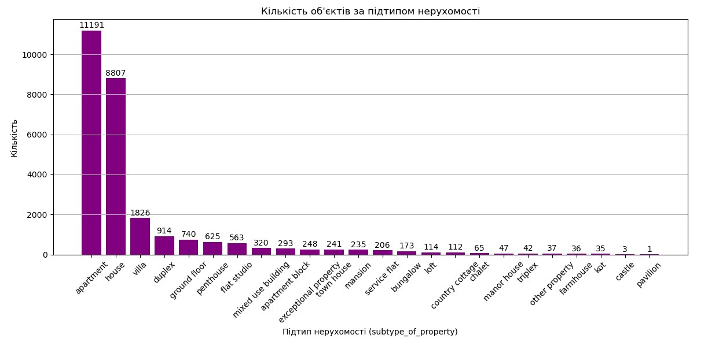
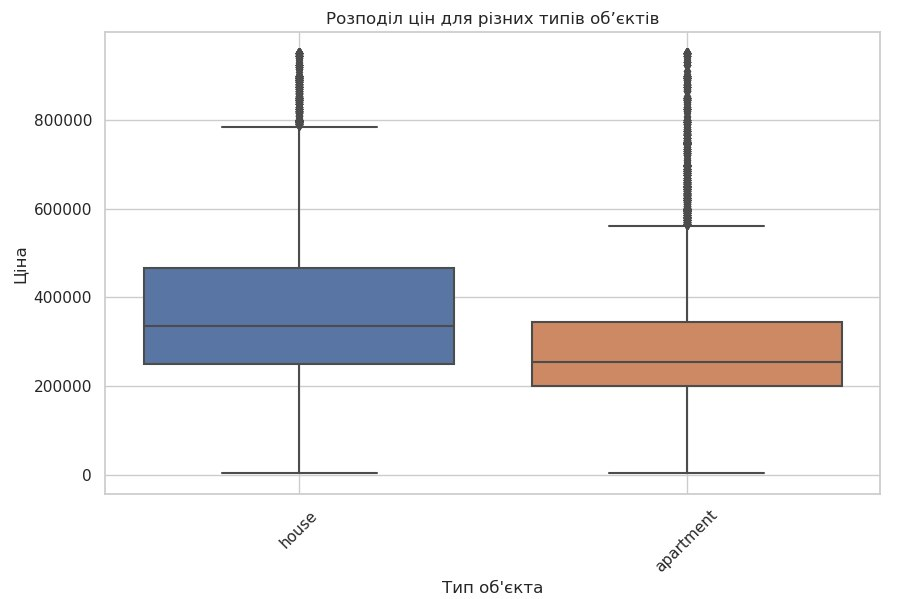
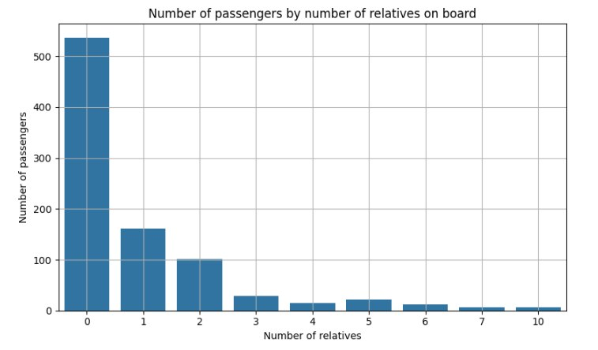
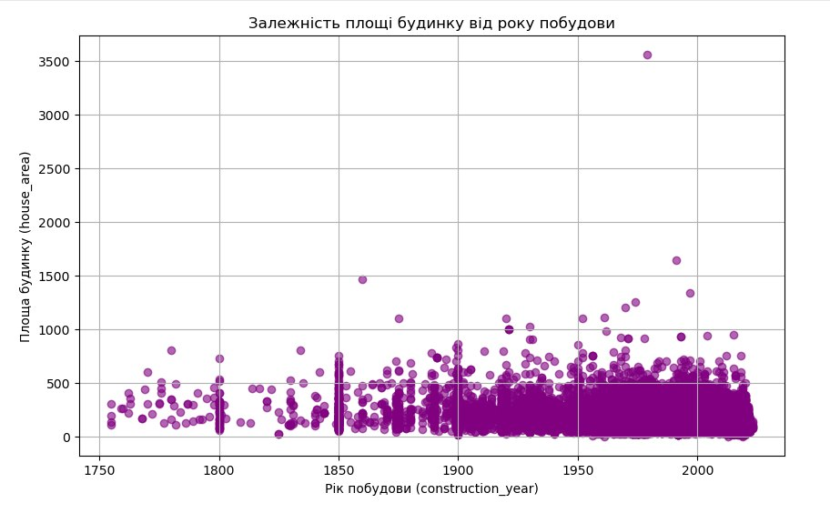
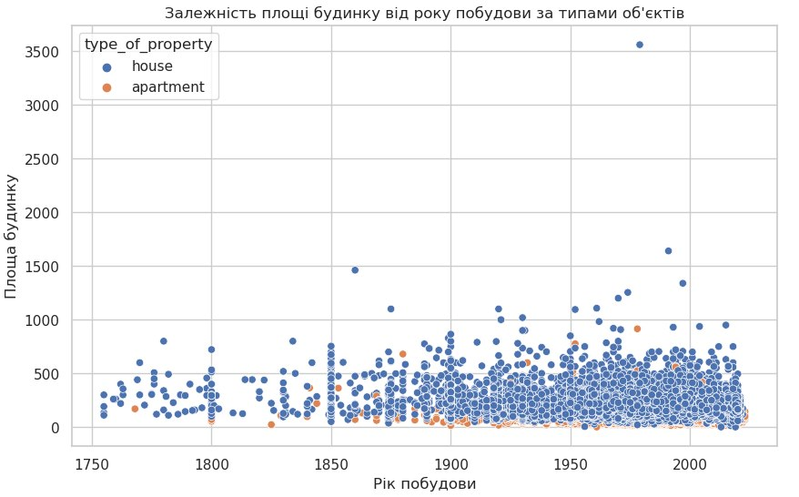
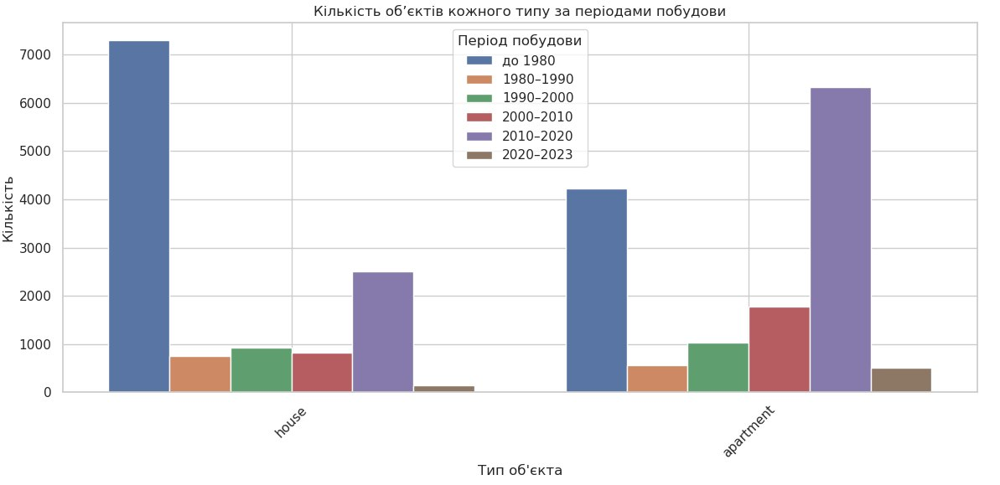
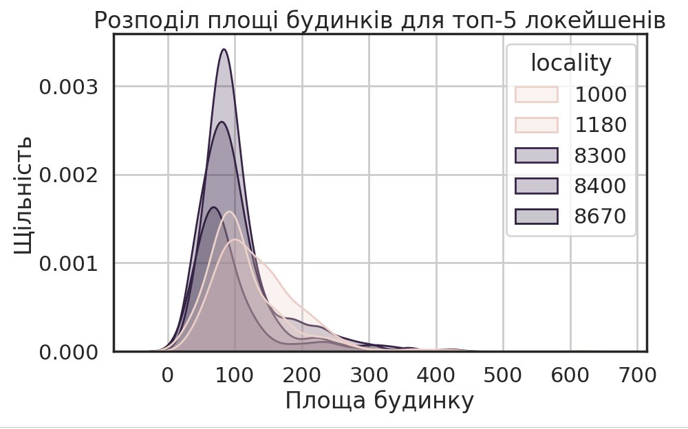

# 🏠 Real Estate Price Analysis (Python EDA Project)

This project presents an exploratory data analysis (EDA) of real estate data using Python.  
The analysis focuses on understanding key factors that influence property prices, size, and distribution across different locations and property types.

## 📊 Ключові візуалізації

  
  

  
  

  
  

  
  

## 🎯 Project Goal

The goal of this analysis is to:
- Understand the relationship between property price and size
- Identify trends in construction over time
- Compare different property types (houses vs apartments)
- Analyze geographic differences in real estate

---

## 🛠 Tools Used

- Python
- Pandas
- NumPy
- Matplotlib
- Seaborn
- Jupyter Notebook

---

## 🔍 Key Insights

- Houses generally have larger areas compared to apartments  
- Newer properties tend to have more standardized sizes  
- Property prices strongly correlate with area  
- Apartments dominate in modern construction periods  
- Significant variation exists across locations  

---

## 📁 Dataset

Real estate dataset including:
- Price
- Area
- Construction year
- Property type
- Location

---

## 🚀 Project Structure
